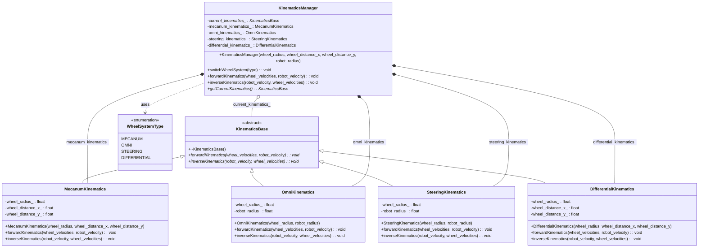

# 轮式机器人运动学切换方案

本文档详细介绍如何实现轮式机器人运动学库中的轮系快速切换功能。

## 设计思路

为了支持在运行时快速切换不同类型的轮系（麦克纳姆轮、全向轮、舵轮、差速二轮），我们采用了策略模式结合工厂模式的设计方案：

1. **策略模式**：将不同轮系的运动学算法封装到各自的类中，这些类都实现同一个接口
2. **组合优于继承**：使用组合而非继承来实现轮系切换
3. **避免动态内存分配**：所有轮系对象在初始化时一次性创建，避免运行时分配内存

## 类图



## 轮系类型枚举

```cpp
enum class WheelSystemType {
    MECANUM,    // 麦克纳姆轮
    OMNI,       // 全向轮
    STEERING,   // 舵轮
    DIFFERENTIAL // 差速二轮
};
```

## 轮系管理器实现

```cpp
class KinematicsManager {
private:
    // 指向当前使用的运动学对象的指针
    KinematicsBase* current_kinematics_;
    
    // 各种轮系的实例
    MecanumKinematics mecanum_kinematics_;
    OmniKinematics omni_kinematics_;
    SteeringKinematics steering_kinematics_;
    DifferentialKinematics differential_kinematics_;
    
public:
    // 构造函数，初始化所有轮系对象
    KinematicsManager(
        float wheel_radius,
        float wheel_distance_x,
        float wheel_distance_y,
        float robot_radius
    ) : 
        mecanum_kinematics_(wheel_radius, wheel_distance_x, wheel_distance_y),
        omni_kinematics_(wheel_radius, robot_radius),
        steering_kinematics_(wheel_radius, robot_radius),
        differential_kinematics_(wheel_radius, wheel_distance_x, wheel_distance_y),
        current_kinematics_(&mecanum_kinematics_) // 默认使用麦克纳姆轮
    {}
    
    // 切换轮系类型
    void switchWheelSystem(WheelSystemType type) {
        switch (type) {
            case WheelSystemType::MECANUM:
                current_kinematics_ = &mecanum_kinematics_;
                break;
            case WheelSystemType::OMNI:
                current_kinematics_ = &omni_kinematics_;
                break;
            case WheelSystemType::STEERING:
                current_kinematics_ = &steering_kinematics_;
                break;
            case WheelSystemType::DIFFERENTIAL:
                current_kinematics_ = &differential_kinematics_;
                break;
        }
    }
    
    // 代理方法，转发到当前选择的轮系实现
    void forwardKinematics(const WheelVelocities& wheel_velocities, RobotVelocity& robot_velocity) {
        current_kinematics_->forwardKinematics(wheel_velocities, robot_velocity);
    }
    
    void inverseKinematics(const RobotVelocity& robot_velocity, WheelVelocities& wheel_velocities) {
        current_kinematics_->inverseKinematics(robot_velocity, wheel_velocities);
    }
    
    // 获取当前轮系类型
    KinematicsBase* getCurrentKinematics() {
        return current_kinematics_;
    }
};
```

## 使用示例

```cpp
// 创建运动学管理器
KinematicsManager kinematics_manager(0.05f, 0.2f, 0.2f, 0.25f);

// 设置机器人期望速度
RobotVelocity desired_velocity = {0.5f, 0.0f, 0.2f};  // 前进0.5m/s，不横移，旋转0.2rad/s
WheelVelocities wheel_velocities;

// 使用默认的麦克纳姆轮计算轮子速度
kinematics_manager.inverseKinematics(desired_velocity, wheel_velocities);

// 应用到电机
for (int i = 0; i < 4; i++) {
    motor_controller.setSpeed(i, wheel_velocities.wheel[i]);
}

// 切换到全向轮
kinematics_manager.switchWheelSystem(WheelSystemType::OMNI);

// 使用全向轮运动学计算轮子速度
kinematics_manager.inverseKinematics(desired_velocity, wheel_velocities);

// 应用到电机
for (int i = 0; i < 4; i++) {
    motor_controller.setSpeed(i, wheel_velocities.wheel[i]);
}
```

## 特殊情况处理

### 舵轮的特殊处理

舵轮系统有两组电机（驱动和转向），需要特殊处理：

```cpp
// 在KinematicsManager中添加舵轮特有的方法
void inverseKinematicsForSteering(const RobotVelocity& robot_velocity, SteerWheelVelocities& steer_wheel_velocities) {
    // 确保当前使用的是舵轮
    if (dynamic_cast<SteeringKinematics*>(current_kinematics_)) {
        SteeringKinematics* steering = static_cast<SteeringKinematics*>(current_kinematics_);
        steering->inverseKinematics(robot_velocity, steer_wheel_velocities);
    } else {
        // 错误处理：当前不是舵轮系统
    }
}
```

### 轮系切换时的平滑过渡

为了避免轮系切换时的突然变化，可以实现平滑过渡：

```cpp
void smoothTransition(const WheelVelocities& current_velocities, 
                     const WheelVelocities& target_velocities,
                     WheelVelocities& output_velocities,
                     float transition_factor) {
    // transition_factor从0到1，表示过渡程度
    for (int i = 0; i < 4; i++) {
        output_velocities.wheel[i] = current_velocities.wheel[i] * (1.0f - transition_factor) +
                                    target_velocities.wheel[i] * transition_factor;
    }
}
```

## 配置持久化

为了支持系统重启后恢复上次使用的轮系配置，可以实现配置持久化：

```cpp
// 保存当前配置
void saveConfiguration(const char* filename) {
    // 确定当前轮系类型
    WheelSystemType current_type;
    if (current_kinematics_ == &mecanum_kinematics_) {
        current_type = WheelSystemType::MECANUM;
    } else if (current_kinematics_ == &omni_kinematics_) {
        current_type = WheelSystemType::OMNI;
    } else if (current_kinematics_ == &steering_kinematics_) {
        current_type = WheelSystemType::STEERING;
    } else {
        current_type = WheelSystemType::DIFFERENTIAL;
    }
    
    // 保存到文件或EEPROM
    // ...
}

// 加载配置
void loadConfiguration(const char* filename) {
    // 从文件或EEPROM加载
    // ...
    WheelSystemType loaded_type = /* 加载的类型 */;
    
    // 切换到加载的轮系类型
    switchWheelSystem(loaded_type);
}
```

## 性能考虑

1. **内联简单函数**：将简单的转发函数标记为内联，减少函数调用开销
2. **预计算常量**：对于不变的参数，预先计算并存储结果

```cpp
// 优化版本的KinematicsManager
class OptimizedKinematicsManager {
private:
    // 使用函数指针代替虚函数调用
    using InverseKinematicsFunc = void (*)(void*, const RobotVelocity&, WheelVelocities&);
    
    void* current_instance_;
    InverseKinematicsFunc current_inverse_func_;
    
    // 其他成员...
    
public:
    // 切换轮系的优化版本
    void switchWheelSystem(WheelSystemType type) {
        switch (type) {
            case WheelSystemType::MECANUM:
                current_instance_ = &mecanum_kinematics_;
                current_inverse_func_ = [](void* instance, const RobotVelocity& robot_velocity, WheelVelocities& wheel_velocities) {
                    static_cast<MecanumKinematics*>(instance)->inverseKinematics(robot_velocity, wheel_velocities);
                };
                break;
            // 其他轮系类似...
        }
    }
    
    // 优化的逆运动学调用
    inline void inverseKinematics(const RobotVelocity& robot_velocity, WheelVelocities& wheel_velocities) {
        current_inverse_func_(current_instance_, robot_velocity, wheel_velocities);
    }
};
```

## 总结

通过使用策略模式和组合设计，我们实现了一个灵活且高效的轮系切换方案，具有以下优点：

1. **无需动态内存分配**：所有轮系对象在初始化时一次性创建
2. **切换开销小**：切换轮系只需改变一个指针
3. **接口统一**：所有轮系共享相同的接口，简化了使用
4. **易于扩展**：添加新的轮系类型只需实现基类接口并在管理器中添加实例
5. **适合嵌入式环境**：设计考虑了资源限制，避免了可能导致内存碎片的动态分配 