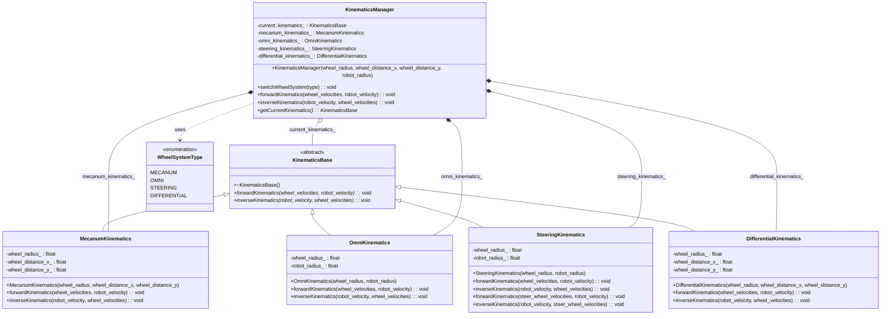

# 轮式机器人运动学库类图

下面是轮式机器人运动学库的类图，展示了各个类之间的继承关系和主要方法：



## 类说明

### KinematicsBase

这是所有运动学类的基类，定义了运动学计算的通用接口：

- `forwardKinematics`: 正运动学，从轮子速度计算机器人速度
- `inverseKinematics`: 逆运动学，从机器人速度计算轮子速度

### MecanumKinematics

麦克纳姆轮运动学实现：

- 属性：
  - `wheel_radius_`: 轮子半径 (m)
  - `wheel_distance_x_`: 底盘中心X轴距离的一半 (m)
  - `wheel_distance_y_`: 底盘中心Y轴距离的一半 (m)

- 方法：
  - 实现了基类定义的正逆运动学接口

### OmniKinematics

全向轮运动学实现：

- 属性：
  - `wheel_radius_`: 轮子半径 (m)
  - `robot_radius_`: 机器人中心到轮子中心的距离 (m)

- 方法：
  - 实现了基类定义的正逆运动学接口

### SteeringKinematics

舵轮运动学实现：

- 属性：
  - `wheel_radius_`: 轮子半径 (m)
  - `robot_radius_`: 机器人中心到轮子中心的距离 (m)

- 方法：
  - 实现了基类定义的正逆运动学接口
  - 增加了舵轮特有的接口，处理驱动和转向两个自由度

### DifferentialKinematics

差速二轮运动学实现：

- 属性：
  - `wheel_radius_`: 轮子半径 (m)
  - `wheel_distance_x_`: 底盘中心X轴距离的一半 (m)
  - `wheel_distance_y_`: 底盘中心Y轴距离的一半 (m)

- 方法：
  - 实现了基类定义的正逆运动学接口

### KinematicsManager

轮系管理器，用于快速切换不同轮系：

- 属性：
  - `current_kinematics_`: 当前使用的运动学对象指针
  - `mecanum_kinematics_`: 麦克纳姆轮运动学实例
  - `omni_kinematics_`: 全向轮运动学实例
  - `steering_kinematics_`: 舵轮运动学实例
  - `differential_kinematics_`: 差速二轮运动学实例

- 方法：
  - `switchWheelSystem`: 切换轮系类型
  - `forwardKinematics`/`inverseKinematics`: 代理方法，转发到当前选择的轮系实现
  - `getCurrentKinematics`: 获取当前轮系对象

### WheelSystemType

轮系类型枚举：
- `MECANUM`: 麦克纳姆轮
- `OMNI`: 全向轮
- `STEERING`: 舵轮
- `DIFFERENTIAL`: 差速二轮

## 数据结构

```cpp
struct RobotVelocity {
    float linear_x;  // X轴线速度 (m/s)
    float linear_y;  // Y轴线速度 (m/s)
    float angular_z; // Z轴角速度 (rad/s)
};

struct WheelVelocities {
    float wheel[4];  // 4个轮子的角速度 (rad/s)
};

struct SteerWheelVelocities {
    float drive[4];  // 驱动电机速度 (rad/s)
    float steer[4];  // 转向电机角度 (rad)
};
``` 